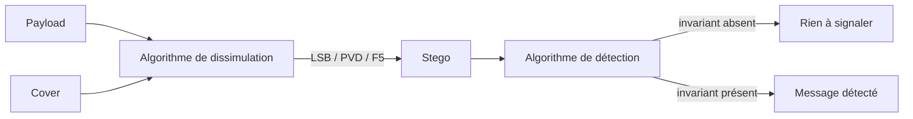
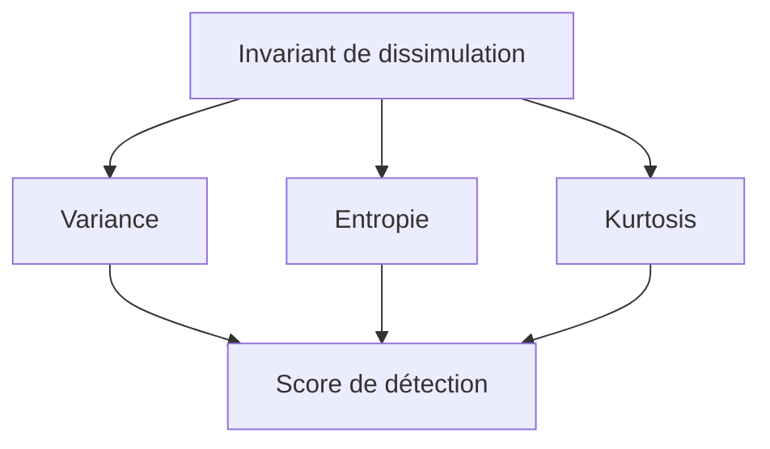

<div class="doc-card">
  <a href="{{ '/assets/pdf/notes/tipe-steganalyse/TIPE-2024-2025-presentation.pdf' | relative_url }}">📊 Support de présentation (PDF)</a>
  <a href="{{ '/assets/pdf/notes/tipe-steganalyse/MCOT.pdf' | relative_url }}">📄 MCOT — motivation &amp; biblio (PDF)</a>
</div>

## D'un bot un peu trop lent à une vraie question de recherche

Tout est parti d'une bêtise de lycée. J'avais construit un petit site qui permettait de cacher des informations dans des images ou du texte, avec plusieurs méthodes de dissimulation que j'implémentais au fur et à mesure. Avec une amie, on s'amusait à s'échanger des messages cachés — jusqu'au jour où s'est posée une question toute simple : comment savoir, en recevant une image, si elle contient réellement un message caché, et avec quelle méthode, sans tout essayer une par une ?

J'ai donc écrit un bot qui testait toutes les méthodes de ma petite base de données et essayait de décoder avec chacune. Ça marchait, mais à mesure que le nombre de méthodes augmentait, le bot devenait de plus en plus lent — la complexité de tester chaque méthode une à une explosait. Ce constat très pratique a fini par devenir la question de recherche de mon TIPE :

> Est-il possible d'identifier un invariant de dissimulation dans des fichiers JPG — une caractéristique commune à toutes les données issues d'un processus de stéganographie, indépendamment de l'algorithme utilisé — permettant de détecter la présence d'information cachée sans connaître la méthode employée ?

## Pourquoi le JPG

La stéganographie consiste à dissimuler un message (le *payload*) dans un support (le *cover*), pour obtenir un fichier *stego* visuellement identique à l'original. Le format JPG s'y prête particulièrement bien, pour plusieurs raisons :

| Critère | JPG | PNG / BMP |
|---|---|---|
| Compression | avec perte (DCT + quantification) | sans perte |
| Intégration du message | dans les coefficients DCT | dans les pixels directement |
| Imperceptibilité | haute (modifications en fréquence) | plus visible |
| Diffusion / usage | très répandu | moins courant |

C'est justement cette étape de compression par transformée en cosinus discrète (DCT) qui offre un espace discret — les coefficients de fréquence — où glisser un message sans trop abîmer l'image visuellement.

## Trois méthodes de dissimulation

Pour rester représentatif sans exploser le scope du TIPE, j'ai retenu trois méthodes très différentes dans leur philosophie :

- **LSB (Least Significant Bit)** : on remplace le bit de poids faible de chaque composante de pixel par un bit du message. Simple, mais peu robuste.
- **PVD (Pixel Value Differencing)** : on exploite la différence entre pixels voisins pour décider combien de bits on peut cacher sans que ce soit visible — plus de bits dans les zones texturées, moins dans les zones lisses.
- **F5** : la méthode la plus sophistiquée des trois, qui insère le message dans les coefficients DCT après compression, avec un codage de Hamming pour minimiser le nombre de modifications nécessaires.



## Le protocole : mesurer avant de conclure

Plutôt que de partir d'une intuition, j'ai construit un jeu de données de 10 000 images (moitié *cover*, moitié *stego*, réparties entre les trois méthodes), et calculé pour chacune une série de caractéristiques statistiques classiques en traitement d'image :

- **Moyenne** des intensités : $\mu = \dfrac{1}{MN}\sum_{i=1}^{M}\sum_{j=1}^{N} I(i,j)$
- **Variance**, pour la dispersion des valeurs
- **Entropie**, pour mesurer le désordre : $H = -\sum_{i=0}^{255} p_i \log_2(p_i)$
- **Skewness** (asymétrie) et **kurtosis** (aplatissement) de la distribution des intensités
- **LSB\_ratio**, la proportion de bits de poids faible à 1

L'idée : si un invariant existe, il doit apparaître comme un déplacement systématique de ces distributions entre images *cover* et images *stego*, quelle que soit la méthode utilisée pour la dissimulation.

## Ce qui ressort des mesures

En comparant les distributions sur les 10 000 images, trois caractéristiques se détachent nettement des autres, avec un déplacement **cohérent** entre *stego* et *non-stego* :

| Caractéristique | Cover (moyenne) | Stego (moyenne) | Écart |
|---|---|---|---|
| Variance | ≈ 24.98 | ≈ 25.95 | +0.97 |
| Entropie | ≈ 7.40 | ≈ 7.50 | +0.10 |
| Kurtosis | ≈ 3.00 | ≈ 3.16 | +0.16 |

La skewness, elle, ne montre presque aucune séparation exploitable — elle sort donc de la liste des candidats. Un clustering K-Means après réduction PCA sur ces caractéristiques fait apparaître une séparation visuelle assez nette entre les deux populations, ce qui confirme que le signal est réel et pas juste du bruit statistique.



À partir de là, un algorithme très simple — un score qui s'incrémente à chaque seuil dépassé (variance, entropie, kurtosis) — suffit déjà à obtenir une détection correcte dans la majorité des cas :

```python
SEUIL_VARIANCE = 25.4
SEUIL_ENTROPIE = 7.45
SEUIL_KURTOSIS = 3.08

def detect_steganography(variance, entropie, kurtosis):
    score = 0
    if variance > SEUIL_VARIANCE:
        score += 1
    if entropie > SEUIL_ENTROPIE:
        score += 1
    if kurtosis > SEUIL_KURTOSIS:
        score += 1
    return 1 if score >= 2 else 0
```

## Passer à l'apprentissage supervisé

Les trois caractéristiques statistiques donnent un signal réel mais imparfait — j'ai donc entraîné un CNN (réseau de neurones convolutif) directement sur les images en niveaux de gris (256×256), avec trois couches de convolution (32, 64, 128 filtres) suivies de couches denses et d'une sortie sigmoïde donnant la probabilité qu'une image soit *stego*.

Sur un jeu de 10 000 images (80% entraînement, 10% validation, 10% test) :

- **Accuracy en test** : 87,5 %
- **AUC** : 0,91
- Précision, rappel et F1-score autour de **97 %** sur la tâche de classification cover/stego
- Le modèle est particulièrement bon sur les stego "fortement modifiés", moins sur les modifications discrètes

## Les limites, honnêtement

Un invariant qui fonctionne bien sur un jeu de données propre n'est pas magique pour autant :

- **Sensibilité à la recompression JPEG** : le bruit introduit par une recompression réduit fortement le signal (l'écart d'entropie tombe de +0.10 à +0.03).
- **Textures naturelles très bruitées** : elles génèrent des faux positifs, estimés autour de 7 %.
- **Méthodes avancées type HUGO**, conçues spécifiquement pour minimiser les traces statistiques détectables : l'écart sur nos caractéristiques devient quasi nul (< 0.01).

Ce dernier point est le plus intéressant à mes yeux : plus une méthode de dissimulation est pensée pour être indétectable statistiquement, moins un invariant "simple" comme celui-ci suffit. C'est précisément ce qui m'a donné envie de continuer dans cette direction après le TIPE — je travaille aujourd'hui sur des méthodes à base de *transformers* pour essayer d'identifier des signatures de dissimulation plus fines que ce que des statistiques classiques peuvent capter. Ce sera probablement le sujet d'un prochain article.

## Pour aller plus loin

Ce travail doit beaucoup à la théorie de l'information de Shannon, à la modélisation de la sécurité stéganographique de Cachin, et à l'ouvrage de référence de Fridrich sur la stéganographie dans les médias numériques — toutes les références précises sont dans le MCOT ci-dessus.
